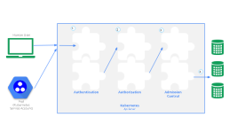

# Kubenetes API

[TOC]
## API
The core of Kubernetes' control plane is the API server. The API server exposes an HTTP API that lets end users, different parts of your cluster, and external components communicate with one another.
The Kubernetes API lets you query and manipulate the state of API objects in Kubernetes (for example: Pods, Namespaces, ConfigMaps, and Events).
Most operations can be performed through the kubectl command-line interface or other command-line tools, such as kubeadm, which in turn use the API. However, you can also access the API directly using REST calls. Kubernetes provides a set of client libraries for those looking to write applications using the Kubernetes API.

The Kubernetes [API reference](https://kubernetes.io/docs/reference/generated/kubernetes-api/v1.30/) lists the API for Kubernetes version v1.30.

## Access Control [^1]
Users access the Kubernetes API using kubectl, client libraries, or by making REST requests. Both human users and Kubernetes service accounts can be authorized for API access. When a request reaches the API, it goes through several stages:
* Authentication
* Authroization
* Admission Control

### Authentication
Kubenetes provides multiple authentication modules, including client certificates, password, and plain tokens, bootstrap tokens, and JSON Web Tokens (used for service accounts).

Multiple authentication modules can be specified for authentication stage, in which case each one is tried in sequence, until one of them succeeds.

### Authorization
Kubernetes supports multiple authorization modules, such as ABAC mode, RBAC Mode, and Webhook mode.

If more than one authorization modules are configured, Kubernetes checks each module, and if any module authorizes the request, then the request can proceed. If all of the modules deny the request, then the request is denied.

### Admission Control [^2]
Kubernetes supports multiple authorization modules, such as ABAC mode, RBAC Mode, and Webhook mode.

When multiple admission controllers are configured, they are called in order. Unlike Authentication and Authorization modules, if any admission controller module rejects, then the request is immediately rejected.

Admission control modules can modify or reject requests.

Here is some usefull admission control modules:
* PodSecurity admission controller
The PodSecurity admission controller checks new Pods before they are admitted, determines if it should be admitted based on the requested security context and the restrictions on permitted <b>Pod Security Standards</b> for the namespace that the Pod would be in.
* ServiceAccount admission controller [^3]
The PodSecurity admission controller
This admission controller implements automation for serviceAccounts. It associates an ServiceAccount with POD during create POD API call. It also mount ServiceAccount token into POD which allows in-cluster processes to talk to the API server.

[^1]: https://kubernetes.io/docs/concepts/security/controlling-access/
[^2]: https://kubernetes.io/docs/reference/access-authn-authz/admission-controllers/
[^3]: https://kubernetes.io/docs/reference/access-authn-authz/service-accounts-admin/#serviceaccount-admission-controller