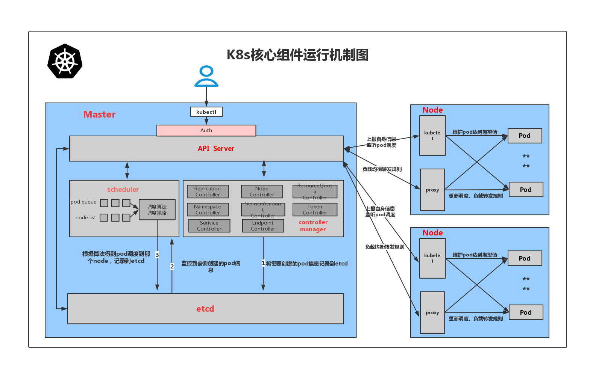

[TOC]

# Work Node
## Kubelet
Kubelet是Kubernetes集群中的一个重要组件，它运行在每个节点上，负责在节点上管理容器和Pod。以下是Kubelet的一些主要功能和作用：

* Pod管理：Kubelet负责维护节点上Pod的生命周期。当Kubelet监听到Master下发的任务，比如要创建、更新、删除一个Pod时，它会通过CRI（容器运行时接口）插件来调用不同的容器运行时（如docker、containerd、rkt等）来执行相应的操作。
* 容器健康检查：Kubelet会监控容器的状态，确保Pod按照预期运行。如果容器出现问题，Kubelet会根据需要启动、停止或重启容器。
* 节点状态汇报：Kubelet启动时会向APIServer进行注册，并定时地向APIServer汇报本节点的信息状态、资源使用状态等，这样Master就能够知道Node节点的资源剩余、节点是否失联等信息。这对于Pod的调度和正常运行至关重要。
* 配置和管理资源：Kubelet还可以配置和管理容器的存储和网络等资源。例如，它可以挂载Pod所需的存储卷，并在Pod终止时卸载这些卷。

## Kube-proxy
Kube-proxy是Kubernetes工作节点上的一个网络代理组件，它运行在每个节点上，负责实现服务发现和负载均衡功能。

Kube-proxy的主要作用包括：
* 服务发现
Kube-proxy通过watch监听API Server中service资源的create、update、delete事件，以获取新的Pod和VIP映射关系，然后通过更新iptables规则来实现请求数据的转发，构建并维护各节点路由信息。
* 服务代理和负载均衡
Kube-proxy将Kubernetes的服务抽象（Service）转换为实际的网络路由规则，使得Pod可以相互通信，并且外部流量可以正确地流入到服务背后的一组Pod中。
Kube-proxy支持多种网络模式，包括iptables模式和IPVS模式。在iptables模式下，kube-proxy通过监控Kubernetes API服务器的变化，动态更新节点上的iptables规则，从而将流入服务IP或端口的流量转发到后端对应的Pod实例。在IPVS模式下，kube-proxy使用内核中的IP Virtual Server（IPVS）模块来提供更高效、更灵活的负载均衡策略，比如轮询、最少连接数、会话亲和性等。

## Container Runtime
容器运行时（Container Runtime）是一种负责在操作系统层面创建和管理容器的软件工具或组件。它是容器化技术的核心组件之一，用于在容器内部运行应用程序，并提供隔离、资源管理和安全等功能。 在Kubernetes中，容器运行时是负责管理和运行容器的组件。
容器运行时的主要任务包括：

* 容器创建和启动：容器运行时负责根据预定义的容器配置信息（如镜像、命令、环境变量等），创建并启动容器实例。
* 容器文件系统管理：容器运行时处理容器的文件系统，负责将镜像的内容挂载到容器的文件系统，并在容器之间提供隔离。
* 资源限制和管理：容器运行时可以根据用户或管理员定义的资源限制，管理容器对CPU、内存、磁盘等资源的使用。
* 容器网络：容器运行时协助配置容器的网络，使得容器可以与其他容器或外部网络进行通信。
* 安全性：容器运行时实施安全机制，确保容器之间和宿主机之间的隔离，并防止容器中的恶意行为影响其他容器或宿主机。

# Master
## Controller Manager [^1]
Kubernetes Controller Manager是Kubernetes集群中的一个重要组件，它负责管理和运行Kubernetes的控制器。

Controller Manager的主要职责包括：

* 资源控制器管理：Controller Manager持续监视Kubernetes集群中的各种资源对象（如Pod、Node、Service、ReplicationController、Deployment等），并确保它们的状态与预期的状态保持一致。
* 自动伸缩和负载均衡：Controller Manager管理自动伸缩控制器和负载均衡控制器。自动伸缩控制器根据定义的自动伸缩规则自动调整Pod的副本数量，以适应应用的负载情况。负载均衡控制器则负责将请求均衡地分发给后端Pod。
* 健康检查和自愈能力：Controller Manager管理健康检查控制器和自愈控制器。健康检查控制器负责监控容器的健康状态，并根据配置的策略进行相应的处理。自愈控制器负责重新启动失败的Pod或迁移运行在不健康节点上的Pod。 

Controller Manager是一个独立的进程，运行在Kubernetes的控制平面节点上。它包含多个控制器，每个控制器都负责处理不同的任务。这些控制器包括副本集控制器、副本控制器、节点控制器、服务控制器、端点控制器等，它们共同确保Kubernetes集群中的各个组件按照预期的方式运行。

## Scheduler[^2]
调度器监测还没分配到Node的新创POD资源，并负责为POD寻找最匹配的Node。kube-scheduler是K8S默认的调度器，属于控制面的一员。
kube-scheduler分两步来为POD挑选适合的Node：
* 过滤
* 评分 

在过滤步骤里，kube-scheduler会把符合条件的Node选出来，筛除不符合条件的Node。接下来打步骤节里，kube-scheduler给每个留下的Node一个分数。最后，POD会被部署到分数最高的Node上。
kube-scheduler为每个调度环节都提供扩展点。Scheduling profile允许对kube-scheduler的每个调度环节进行配置。扩展点包括：
* queueSort
* preFilter
* filter
* postFilter
* preScore
* score
* reserve
* permit
* preBind
* bind
* postBind

## API Server

## Etcd

[^1]: https://cloud.tencent.com/developer/article/2327654
[^2]: https://kubernetes.io/docs/concepts/scheduling-eviction/kube-scheduler/