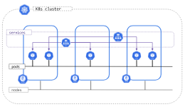

# Networking
## K8S IP address range[^3]

Kubernetes clusters require to allocate non-overlapping IP addresses for Pods, Services and Nodes, from a range of available addresses configured in the following components:

* The network plugin is configured to assign IP addresses to Pods.
* The kube-apiserver is configured to assign IP addresses to Services.
* The kubelet or the cloud-controller-manager is configured to assign IP addresses to Nodes.

## POD IP, Node IP, Cluster IP [^2]  
|名称|说明|
|-|-|
|NodeIP|Worker 节点的IP地址，即物理网卡的 IP 地址。|
|PodIP|	Pod 的 IP 地址，即 Containerd 容器的IP 地址，此为虚拟 IP 地址。|
|ClusterIP|	Service 的 IP 地址，此为虚拟 IP 地址。|

### NodeIP
可以是物理机的 IP（也可能是虚拟机 IP）。

* 每个Service都会在Node节点上开通一个端口，外部可以通过 nodeIP:nodePort 即可访问nService里的nPod，和我们访问服务器部署的项目一样，IP:端口/项目名

### Pod IP
Pod IP 是每个 Pod 的 IP 地址，他是 Containerd Engine 根据网桥的IP地址段进行分配的，通常是一个虚拟的二层网络（通过VxLAN overlay在底层NodeIP网络上?）

* 同一 Service 下的 Pod 可以直接根据 PodIP 相互通信。
* 不同 Service下的pod在集群间pod通信要借助于 ClusterIP
* Pod 和集群外通信，要借助于 NodeIP

### ClusterIP
即 Service 的 IP 地址，是虚拟 IP 地址。在集群外部无法 Ping 通，只能在集群内部使用。

ClusterIP是一个虚拟的 IP，但更像是一个伪造的 IP 网络，原因有以下几点：

* ClusterIP 仅仅作用于 Service 对象，并由 Kubernetes 管理和分配地址
* ClusterIP 无法被 Ping，他没有一个“实体网络对象”来响应
* ClusterIP 只能结合 ServicePort 组成一个具体的通信端口，单独的 ClusterIP 不具备通信的基础，并且他们属于 Kubernetes 集群这样一个封闭的空间。

在不同 Service 下的 Pod 节点在集群间可以通过 ClusterIP 相互访问

## 双协议栈
IPv4/IPv6 双协议栈网络能够将 IPv4 和 IPv6 地址分配给 Pod 和 Service。
Kubernetes 集群的 IPv4/IPv6 双协议栈可提供下面的功能：

* 双协议栈 pod 网络 (每个 pod 分配一个 IPv4 和 IPv6 地址)
* IPv4 和 IPv6 启用的服务
* Pod 的集群外出口通过 IPv4 和 IPv6 路由

使用双栈协议的前提条件和集群配置，参考[^1]

### POD 双栈 IP
在Pod的定义中，通常不需要特别指定IPv4或IPv6地址，因为Kubernetes会根据集群的配置和网络插件自动为Pod分配IP地址。

### Service 双栈 IP
你可以使用 IPv4 或 IPv6 地址来创建 Service。服务的地址族默认为第一个服务集群 IP 范围的地址族（通过 kube-apiserver 的 --service-cluster-ip-range 参数配置）。

当你定义服务时，可以选择将其配置为双栈。若要指定所需的行为，你可以设置 .spec.ipFamilyPolicy 字段为以下值之一：
* SingleStack
* PreferDualStack
* RequireDualStack

[^1]: https://v1-26.docs.kubernetes.io/zh-cn/docs/concepts/services-networking/dual-stack/
[^2]: https://www.cnblogs.com/unchch/p/17086916.html#12pod-ip
[^3]: https://kubernetes.io/docs/concepts/cluster-administration/networking/#kubernetes-ip-address-ranges
