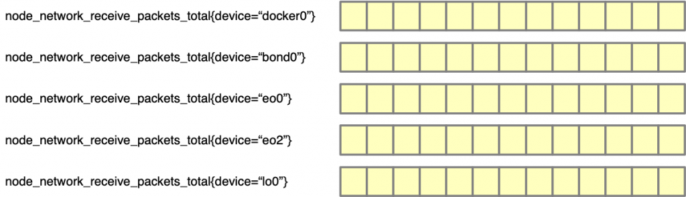
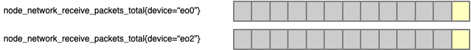
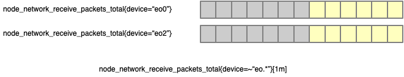
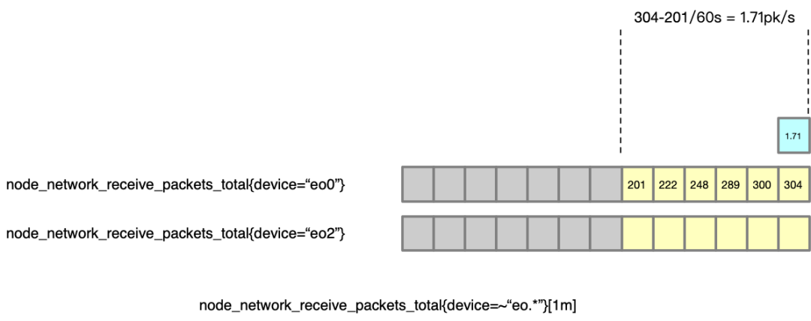
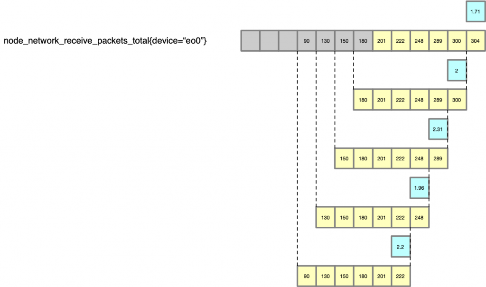

[TOC]
# Data Model
Prometheus的数据都是时间序列。

## 指标（Metrics）
Promethues用指标来描述系统的某个行为特征。
指标由指标名来标识，指标名一般描述了指标的含义。例如，
```
node_network_receive_packets_total
```
顾名思义这是一个统计节点接收到的包总数的指标，它应该是一个Counter类型的指标，随时间单调递增。
要记录这个行为特征，最自然的办法就是每隔一段时间采样一次这段时间内节点接收到包数，把得到的结果和上一个指标值相加，然后保存。这样就得到反应该行为特征的时间序列了。
|时间|t1|t2|t3|t4|t5|...|t10|
|-|-|-|-|-|-|-|-|
|接收到的包数|10|15|12|8|20|...|14|
|node_network_receive_packets_total|10|25|37|45|65|...|127|
## 指标类型
Prometheus提供两种基础的指标类型：
* Gauge
* Counter

## 指标 和 时间序列 
一个指标上可以附加很多标签，每个独一无二的指标(Metrics)和标签（Label)的组合都标识一个时间序列。所以，理论上一个指标可以对应着许多个时间序列，每个时间序列代表了该指标上一个独一无二的标签组合。
例如，我们的节点上一共5个不同的网络接口，可以给上面统计节点接收到的包总数的指标添加一个表示网络接口的device标签。Promethues为每个标签组合都产生一个时间序列，那么我们就得到了该指标的如下时间序列：
```
node_network_receive_packets_total{device="docker0"}
node_network_receive_packets_total{device="bond0"}
node_network_receive_packets_total{device="eo0"}
node_network_receive_packets_total{device="eo2"}
node_network_receive_packets_total{device="lo0"}
.......
```
下面这张图简单地表示了 Metric 在 Prometheus 中的样子。可以理解为Prometheus给这个指标的数据添加了一个名为device的维度，并为一维空间里的每个值（一维空间内的点）生成一个单独的时间序列。

如果，我们系统里面由两个不同的node，node1上有上述5个网络接口，node2上有docker0和bond0接口。那么，可以给node_network_receive_packets_total再添加一个node标签。Promethues为每个标签组合都产生一个时间序列，那么我们就得到了该指标的如下时间序列：
```
node_network_receive_packets_total{node="node1",device="docker0"}
node_network_receive_packets_total{node="node1",device="bond0"}
node_network_receive_packets_total{node="node1",device="eo0"}
node_network_receive_packets_total{node="node1",device="eo2"}
node_network_receive_packets_total{node="node1",device="lo0"}
node_network_receive_packets_total{node="node2",device="docker0"}
node_network_receive_packets_total{node="node2",device="bond0"}
```
可以理解为Promethues给这个数据添加了两个维度，分别是node和device，并给这二维空间内的每对值的组合（二维空间内的点）生成一个单独的时间序列。

## PromQL 语言的数据类型 [^1]
这里说明一下 Metric Type 和 PromQL 查询语言中的数据类型的区别。很简单，在写 PromQL 的时候，无论是 Counter 还是 Gauge，对于函数来说都是一串数字，他们数据结构上没有区别。我们说的 Instant Vector 还是 Range Vector, 指的是 PromQL 函数的入参和返回值的类型。
(本节的例子中，假定指标上只有一个device标签)
### Instant Vector
Instant 是立即的意思，Instant Vector 顾名思义，就是当前的值。假如查询的时间点是 t，那么查询会返回距离 t 时间点最近的一个值。
实际上，如果你使用下面的查询语句，将会仅仅得到一个数字，而不是整个 metric 的历史数据（node_network_receive_packets_total{device=~"eo.*"} 得到的是下图中黄色的部分。

这个就是 Instant Vector：只查询到 metric 的在某个时间点（默认是当前时间）的值。
### Range Vector
Range Vector 顾名思义，返回的是一个 range 的数据。
Range 的表示方法是 [1m]，表示 1 分钟的数据。也可以使用 [1h] 表示 1 小时，[1d] 表示 1 天。
假如我们对 Prometheus 的采集配置是每 10s 采集一次，那么 1 分钟内就会有采集 6 次，就会有 6 个数据点。我们使用 node_network_receive_packets_total{device=~“eo.*”}[1m] 查询的话，就可以得到以下的数据：两个 metric，最后的 6 个数据点。

### Grafana如何绘图
Grafana绘图需要提供类型为Instant Vector的表达式。它其实会根据表达式从时间序列中得到一个Instant Vector的序列，然后为Instant Vector序列上的每个维度绘制一根曲线。
例如，用下面的表达式绘图。
```
node_network_receive_packets_total
```
该表达式的Instant Vector是由指标所有时间序列的瞬时值组成的向量。所以，它包含7个数字。每个数字代表一个{node=\*，device=\*}的组合。
Grafana根据这个表达式会画出7根曲线，横轴是时间，纵轴是指标的单位（这里是请求个数）。横轴上的每个时间点对应7个值（每根曲线得到1个值），这7个值就是该时刻的Instant Vector。横轴上每个点的Instant Vector连起来就是一个Instant Vector序列了。
例如，用下面的表达式绘图
```
node_network_receive_packets_total{device='bond0'}
```
该表达式的Instant Vector是由指标中device标签为bond0的所有时间序列的瞬时值组成的向量。所以，它包含2个数字。每个数字代表一个{node=\*，device='bond0'}的组合。
Grafana根据这个表达式会画出2根曲线.


## Prometheus 函数 [^2]

### rate 函数
rate函数接收一个Range Vector作为入参，返回结果是一个Instant Vector。其功能是计算输入Range Vector的每秒平均增速。
例如：
node_network_receive_packets_total 是一个 Counter，为了计算每秒的 packet 数量，我们要计算每秒的数量，就要用到 rate 函数。
先来看一个时间点的计算，假如我们计算 t 时间点的每秒 packet 数量，rate 函数可以帮我们用这段时间（[1m]）的总 packet 数量，除以时间 [1m] ，就得到了一个“平均值”。

以这种方法就得到了一个点的数据。对每个标签的时间序列分别计算，就得到了输出的Instant Vector。
#### Grafana如何绘制rate
因为rate的返回值就是Instant Vector，所以Grafana可以绘制rate函数的结果。
刚才介绍了rate函数计算的过程。
如果对之前的每一个时间点，都以此法进行计算，就得到了Instant Vector序列。
下图展示了，{device='eo0'}标签时间序列的计算过程，（最长的那条是原始的数据，黄色的表示 rate 对于每一个点的计算过程，蓝色的框为最终的绘制的点）。


## Prometheus 聚合器[^3]
Prometheus支持对Instant Vector中的数据按标签聚合。聚合操作的结果是一个新的Instant Vector，只包含聚合标签。
### sum聚合器
sum聚合器接收一个Range Vector作为入参，返回结果是另一个Range Vector。
例如:
假如有个http_requests_total指标，它的时间序列是按照application, instance 和group这三个标签展开的。我们可以用下面的聚合公式计算出每个不同application和group组合的HTTP 请求数。可以看出，聚合后的Instant Vector中instance标签/维度消失了。
> sum without (instance) (http_requests_total)

等效的聚合公式:
> sum by (application, group) (http_requests_total)

如果，我们只对全局的HTTP请求数感兴趣，那么可以用如下聚合公式，聚合后的Instant Vector将不包含任何标签，即只有一个数字。
> sum(http_requests_total)


[^1]: https://blog.csdn.net/alex_yangchuansheng/article/details/120520480
[^2]: https://prometheus.io/docs/prometheus/latest/querying/functions/
[^3]: https://prometheus.io/docs/prometheus/latest/querying/operators/#aggregation-operators